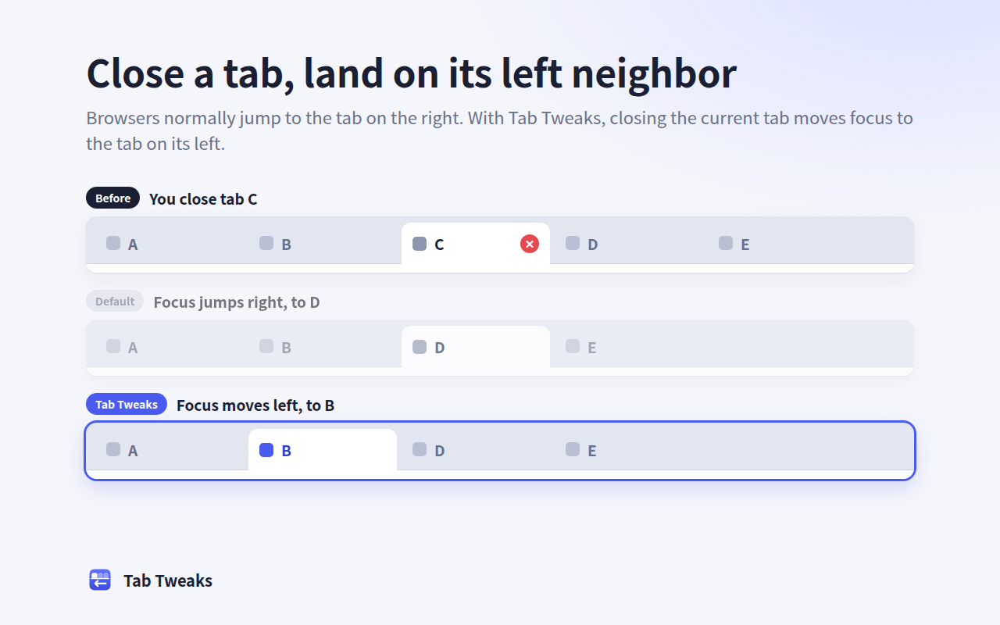
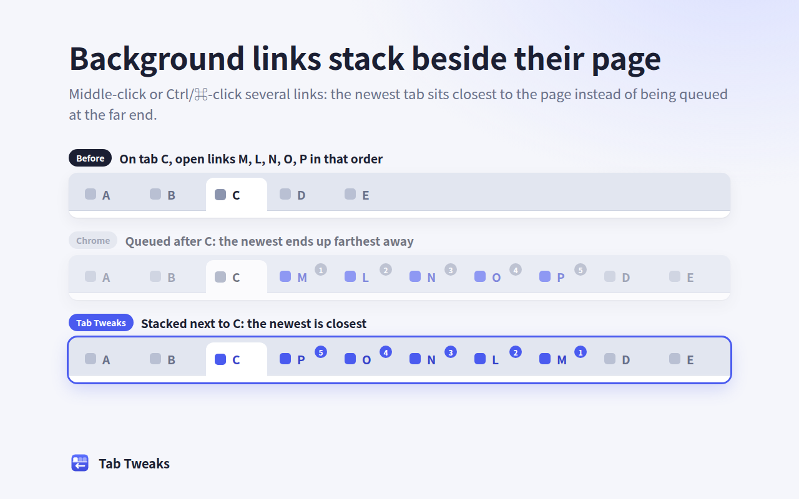

# Tab Tweaks

**Saner tab behavior for Chrome and Edge, with three small tweaks.**

English | [简体中文](README.zh-CN.md)

---

## ✨ Features

| Tweak | Browser default | With Tab Tweaks |
|---|---|---|
| **Close a tab → focus its left neighbor** | `A B [C] D E`, close C → **D** | `A B [C] D E`, close C → **B** |
| **Links stack beside their page** | Open M L N O P from C → `C M L N O P` | Open M L N O P from C → `C P O N L M`, newest closest |
| **New tab opens next to the current one** | Ctrl+T → far right end | Ctrl+T → right after the current tab |

> [!NOTE]
> The third tweak covers Ctrl+T, the New Tab button and Alt+Enter in the address bar alike; the extension API can't tell them apart.
> Everything else (closing a background tab, bookmarks, reopening closed tabs) keeps the browser's native behavior.

🖼️ <b>Screenshots</b>

 

## 📦 Install

### 🟦 Microsoft Edge

Install from **[Microsoft Edge Add-ons](https://microsoftedge.microsoft.com/addons/detail/tab-tweaks/alkbfjcolfgfonhancipekiegolepjie)**.

### 🛠️ From source (Chrome or Edge)

1. Open `chrome://extensions` (`edge://extensions` in Edge).
2. Turn on **Developer mode**.
3. Click **Load unpacked** and select this repository's directory.

## 🔒 Privacy and permissions

- **Only one permission, `storage`**, which shows no warning at install time. It is used only for `chrome.storage.session`, to keep each window's tab order in browser memory (never written to disk, cleared when the browser exits) so the service worker can pick up where it left off after being stopped.
- **No `tabs` permission**: the `chrome.tabs` API works without it; that permission only adds access to tab URLs, titles and favicons, which this extension doesn't need.
- **No page content read, no network requests, no data collected.** See [PRIVACY.md](PRIVACY.md).

## ⚠️ Known limitations

- **Brief focus flicker on close**: the browser activates the right neighbor first, then the extension switches to the left one. About 10 ms in testing, about 20–30 ms right after the service worker wakes up (Chrome for Testing 147). The public MV3 API has no "before close" hook, so this can't be fully eliminated.
- **New tabs may visibly jump**: a new tab first appears where the browser puts it (the far right end for Ctrl+T) and is then moved; right after the service worker wakes up the move may be visible. It doesn't take focus away from the address bar, so you can type a URL right after Ctrl+T.
- **Collapsed groups expand**: if the left neighbor is inside a collapsed tab group, activating it expands the group.
- **Group edge case**: when the opener is the last tab of a tab group, the new tab may land outside the group and Chrome removes it from the group. Fixing this would need the `tabGroups` permission, which is skipped in favor of minimal permissions.

## 🧑‍💻 Development

⚙️ <b>How it works</b>

 

An MV3 service worker (`background.js`):

- **State**: each window keeps `{ order: tabId[], active }`. The `onCreated`/`onMoved`/`onAttached`/`onDetached`/`onRemoved`/`onReplaced` events carry the position that changed, so the order is updated directly from them and is always exact, without relying on async queries.
- **`chrome.tabs.onRemoved`** → if the closed tab was active and not leftmost, take the tab to its left from `order` and activate it right away with `tabs.update`.
- **`chrome.tabs.onCreated`** → if `tab.openerTabId` is set, `move` the new tab to `opener.index + 1`. Background link tabs therefore stack up. Tabs from Ctrl+T, the New Tab button and Alt+Enter are placed at the far right by Chrome, but they also carry an `openerTabId` pointing to the current tab (Chrome uses it to return there on close), so they get moved next to the current tab. Foreground link tabs are already placed right after the opener and need no move. Within a window, moves run through a promise queue so they execute in event order, which is what produces the stacking.
- **Surviving service-worker shutdown**: the browser stops an idle service worker after about 30 seconds, wiping its memory, and the event that wakes it is often the very close it must handle — by then the closed tab is gone and its position can't be queried. So the state is mirrored to `chrome.storage.session` in real time, and every listener first does `await ready` (waits for the state to be restored), then handles events in order. On install, update and browser startup the session storage is empty, so the state is rebuilt with `chrome.tabs.query({})`.

🚀 <b>Packaging and publishing</b>

 

- `scripts/package.sh` builds the store upload package `dist/tab-tweaks-<version>.zip` (containing only `manifest.json`, `background.js`, `_locales/` and `icons/`).
- `store/` holds the store assets: screenshots, promo tiles and the Edge logo. `store/render.sh` regenerates them, along with `icons/`, from `store/icon.svg` and `store/src/*.html`.
- The full publishing steps for the Chrome Web Store and Edge Add-ons, with ready-to-paste listing texts, are in [docs/publishing.md](docs/publishing.md) (Chinese).

